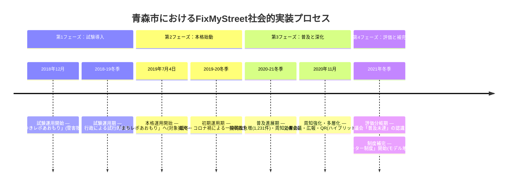

# FMSあおもり — FixMyStreet 社会的実装の記録

青森市における市民参加型課題共有プラットフォーム「FixMyStreet（FMS）」の導入・運用プロセスを整理・可視化するプロジェクトです。

## 概要

青森市では2018年に「ゆきレポあおもり」として雪害報告の仕組みを試験導入し、その後「まちレポあおもり」として対象を拡大しました。本リポジトリでは、その社会的実装の過程を年表やマップとしてまとめています。

## タイムライン

## 背景

FixMyStreetは、市民が地域の課題（道路の損傷、不法投棄、雪害など）を地図上で報告し、行政と共有できるプラットフォームです。青森市では独自にこの仕組みを導入し、市民協働のまちづくりに活用しています。
